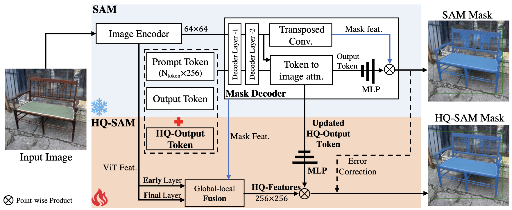

# Обзор подходов к domain adaptation

# Введение
## Domain adaptation
Адаптация домена представляет собой метод машинного обучения, направленный на улучшение производительности модели на целевом наборе данных (домене), который может отличаться по распределению от исходного набора данных (домене источника). Этот процесс критически важен в ситуациях, когда данные источника и целевого доменов распределены по-разному, но при этом сохраняется общность между задачами. Domain adaptation позволяет эффективно использовать знания, полученные из источника, для повышения точности и надежности модели на целевом домене, даже если в последнем имеется ограниченное количество аннотированных данных.

# Подходы

## 1. Instance-Based Adaptation
Методы адаптации, основанные на экземплярах, фокусируются на перераспределении весов образцов из исходного домена, чтобы они стали более похожими на образцы из целевого домена. Основная идея заключается в том, чтобы корректировать вес каждого экземпляра источника таким образом, чтобы уменьшить различия между распределениями данных из источника и целевого доменов. Это достигается путем увеличения весов тех экземпляров, которые ближе к целевому домену, и уменьшения весов тех, которые находятся дальше. Примеры таких методов включают алгоритмы важностного взвешивания и переподборки.

## 2. Feature-Based Adaptation
Методы, основанные на признаках, нацелены на выравнивание распределений признаков источника и целевого доменов. Эти методы включают несколько подкатегорий:

### 2.1 Subspace-based
Подходы, основанные на подпространствах, стремятся найти общее подпространство, в котором распределения признаков источника и целевого доменов будут максимально выровнены. Примеры таких методов включают Канонический корреляционный анализ (CCA), когда признаки обоих доменов проецируются в подпространство с максимальной корреляцией между ними.

### 2.2 Transformation-based
Методы, основанные на трансформациях, используют различные преобразования для выравнивания распределений признаков. Эти подходы включают такие методы, как Kernel Mean Matching (KMM), который минимизирует различия в распределении признаков путем применения ядерных методов для сопоставления средних значений признаков источника и целевого доменов.

### 2.3 Reconstruction-based
Реконструктивные подходы используют автоэнкодеры и другие модели для восстановления исходных данных из признаков. Идея состоит в том, чтобы обучить модель, способную восстанавливать данные, таким образом, чтобы она могла обобщаться как на источник, так и на целевой домен. Примеры включают Sparse Autoencoders и Stacked Denoising Autoencoders.

## 3. Deep Domain Adaptation
Глубокие методы адаптации к домену используют нейронные сети для выравнивания распределений доменов и включают несколько подкатегорий:

### 3.1 Discrepancy-based
Методы, основанные на расхождении, минимизируют различия между распределениями доменов, используя различные метрики расхождения. Примеры включают максимальное среднее расхождение (MMD) и H-расстояние, которые измеряют различия между распределениями признаков источника и целевого доменов.

### 3.2 Reconstruction-based
Реконструктивные подходы в контексте глубокого обучения используют автоэнкодеры и их вариации для выравнивания распределений данных. В этих методах сети обучаются восстанавливать данные источника и целевого домена, что позволяет моделям лучше понимать структуру обоих доменов.

### 3.3 Adversarial-based
Состязательные подходы используют состязательные сети (GAN) для уменьшения разрыва между доменами. В таких методах дискриминатор обучается различать данные из источника и целевого доменов, в то время как генератор пытается создать данные, которые дискриминатор не сможет отличить. Примеры включают Domain-Adversarial Neural Networks (DANN) и Adversarial Discriminative Domain Adaptation (ADDA).

# Обзор библиотек и датасетов для Domain Adaptation

Domain adaptation (адаптация домена) - это метод машинного обучения, который позволяет моделям обучаться на данных одного домена (source domain) и затем применять полученные знания к данным другого домена (target domain). Это особенно полезно, когда есть нехватка размеченных данных в целевом домене, но достаточно данных в исходном домене. Рассмотрим популярные библиотеки и датасеты, которые облегчают процесс domain adaptation.

#### Библиотеки для Domain Adaptation

### 1. **PyTorch Domain Adaptation (PyTorch-DA)**
**PyTorch-DA** - это библиотека для domain adaptation на основе фреймворка PyTorch. Она предлагает множество готовых к использованию методов и инструментов для выполнения различных задач domain adaptation.

- **Возможности:**
  - Различные методы domain adaptation, включая adversarial-based методы, такие как DANN (Domain-Adversarial Neural Network), и reconstruction-based методы.
  - Удобный API, который легко интегрируется с существующими моделями PyTorch.
  - Поддержка нескольких доменов и легко масштабируемые решения.

### 2. **Transfer Learning Toolkit (TLT)**
**Transfer Learning Toolkit (TLT)** от NVIDIA предоставляет набор инструментов для переноса обучения и адаптации доменов. TLT предлагает оптимизированные модели и рабочие процессы для быстрой адаптации доменов.

- **Возможности:**
  - Оптимизированные модели для различных задач, включая классификацию изображений, объектное распознавание и сегментацию.
  - Интеграция с платформой NVIDIA GPU для ускорения обучения и вывода.
  - Легкость в использовании благодаря предоставленным примерам и документации.

### 3. **Adapt**
**Adapt** - библиотека на основе Scikit-learn для доменной адаптации.

- **Возможности:**
  - Поддержка нескольких адаптационных стратегий.
  - Совместимость с моделями Scikit-learn.
  - Простота использования и хорошая документация.

### 4. **DeepCORAL**
**DeepCORAL** - реализация Deep CORAL (Correlation Alignment) на PyTorch и TensorFlow.

- **Возможности:**
  - Выравнивание распределений исходного и целевого доменов.
  - Легкая интеграция с существующими моделями PyTorch и TensorFlow.
  - Эффективность и простота реализации.

### 5. **MMD**
**MMD** - библиотека для Maximum Mean Discrepancy (MMD) на основе PyTorch.

- **Возможности:**
  - Минимизация различий между распределениями исходного и целевого доменов.
  - Легкость интеграции и использования с PyTorch моделями.

#### Датасеты для Domain Adaptation

### 1. **Office-31**
**Office-31** - один из самых известных датасетов для domain adaptation, содержащий изображения из трех различных доменов: Amazon, Webcam и DSLR.

- **Детали:**
  - **Amazon**: Изображения, собранные с сайта Amazon.
  - **Webcam**: Изображения, снятые с помощью веб-камеры.
  - **DSLR**: Изображения, снятые с помощью DSLR-камеры.
  - 31 класс объектов, общих для всех трех доменов.

### 2. **VisDA-2017**
**VisDA-2017** - большой датасет для визуальной domain adaptation, содержащий синтетические и реальные изображения.

- **Детали:**
  - **Синтетический домен**: Генерированные изображения.
  - **Реальный домен**: Реальные фотографии.
  - 12 классов объектов.

### 3. **Digits**
**Digits** - датасет, содержащий изображения цифр из разных источников, таких как MNIST, USPS и SVHN.

- **Детали:**
  - **MNIST**: Рукописные цифры.
  - **USPS**: Цифры из почтовых индексов.
  - **SVHN**: Цифры из фото домов.

### 4. **DomainNet**
**DomainNet** - крупный и разнообразный датасет для domain adaptation с изображениями из шести разных доменов.

- **Детали:**
  - **Clipart**: Изображения в стиле клипартов.
  - **Infograph**: Инфографики.
  - **Painting**: Картины.
  - **Quickdraw**: Рукописные рисунки.
  - **Real**: Реальные фотографии.
  - **Sketch**: Эскизы.

### 5. **Office-Home**
**Office-Home** - датасет для domain adaptation, содержащий изображения из четырех доменов: Art, Clipart, Product, и Real-World.

- **Детали:**
  - **Art**: Художественные изображения.
  - **Clipart**: Клипарты.
  - **Product**: Фото продуктов.
  - **Real-World**: Реальные изображения.
  - 65 классов объектов.

# Заключение
Рассмотренные методы адаптации к домену предлагают разнообразные подходы к решению этой проблемы, каждый из которых имеет свои преимущества и применимость в различных сценариях.

**IBA** методики фокусируются на перераспределении весов экземпляров данных, чтобы они стали более похожими на целевые. Этот подход особенно полезен, когда различия между доменами минимальны, и необходимо тонко настроить веса для улучшения общей производительности модели.

**FBA** включает методы, которые нацелены на выравнивание признаков данных из разных доменов. Подкатегории, такие как subspace-based, transformation-based и reconstruction-based, предоставляют мощные инструменты для создания общих представлений, уменьшающих разрыв между доменами. Эти методы находят широкое применение в задачах с высокоразмерными данными, где важно выравнивание признаков.

**DDA** использует глубокие нейронные сети для адаптации к домену, предлагая высокоэффективные подходы для обработки сложных и многомерных данных. Discrepancy-based методы минимизируют различия между распределениями, reconstruction-based подходы восстанавливают данные из признаков, а adversarial-based методы используют состязательные сети для обучения модели, устойчивой к различиям между доменами.

Эти методы адаптации к домену не только улучшают производительность моделей на целевых данных, но и расширяют возможности применения машинного обучения в реальных задачах, где данные могут быть неполными или разнородными. С развитием технологий и появлением новых подходов, такие как adversarial-based методы, адаптация к домену становится все более мощным инструментом для создания универсальных и устойчивых моделей.
